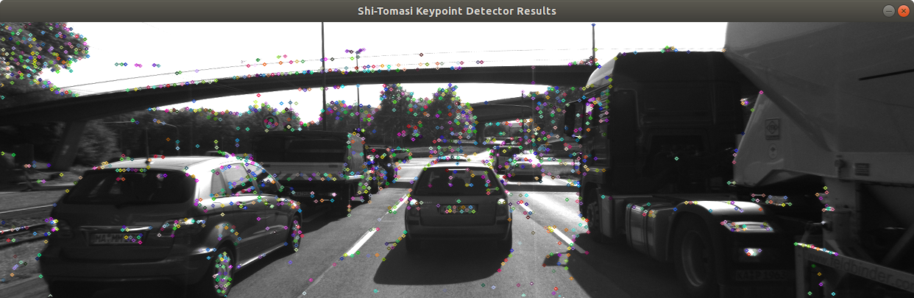
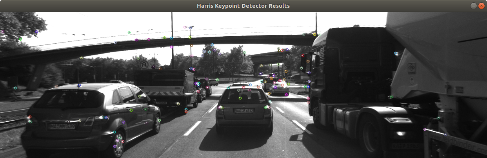
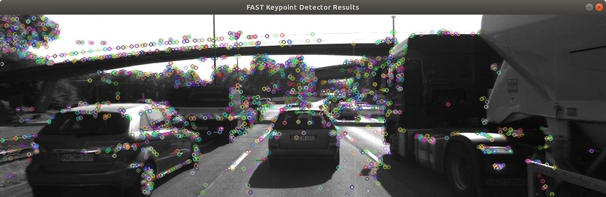
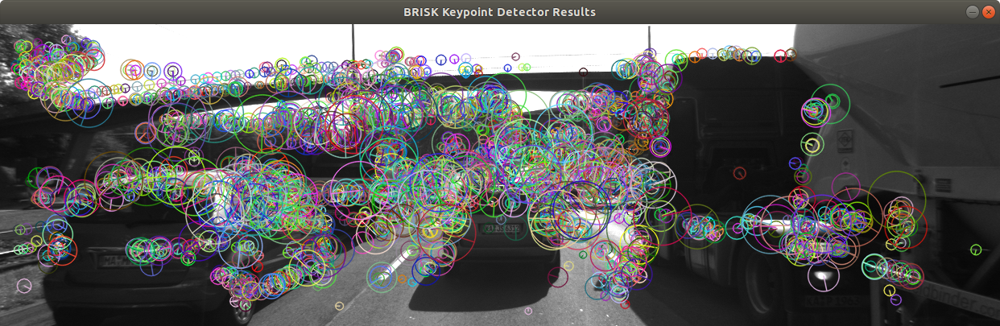
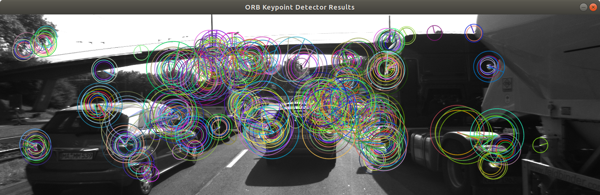
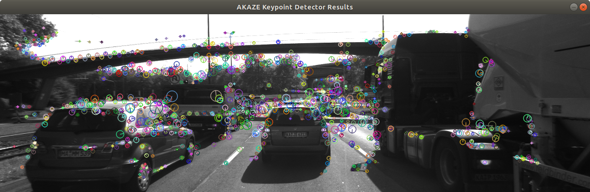
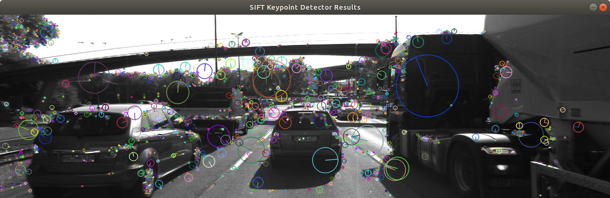

# SFND 2D Feature Tracking


The idea of the camera course is to build a collision detection system - that's the overall goal for the Final Project. As a preparation for this, you will now build the feature tracking part and test various detector / descriptor combinations to see which ones perform best. This mid-term project consists of four parts:

* First, you will focus on loading images, setting up data structures and putting everything into a ring buffer to optimize memory load.
* Then, you will integrate several keypoint detectors such as HARRIS, FAST, BRISK and SIFT and compare them with regard to number of keypoints and speed.
* In the next part, you will then focus on descriptor extraction and matching using brute force and also the FLANN approach we discussed in the previous lesson.
* In the last part, once the code framework is complete, you will test the various algorithms in different combinations and compare them with regard to some performance measures.

See the classroom instruction and code comments for more details on each of these parts. Once you are finished with this project, the keypoint matching part will be set up and you can proceed to the next lesson, where the focus is on integrating Lidar points and on object detection using deep-learning.

## Dependencies for Running Locally
1. cmake >= 2.8
 * All OSes: [click here for installation instructions](https://cmake.org/install/)

2. make >= 4.1 (Linux, Mac), 3.81 (Windows)
 * Linux: make is installed by default on most Linux distros
 * Mac: [install Xcode command line tools to get make](https://developer.apple.com/xcode/features/)
 * Windows: [Click here for installation instructions](http://gnuwin32.sourceforge.net/packages/make.htm)

3. OpenCV >= 4.1
 * All OSes: refer to the [official instructions](https://docs.opencv.org/master/df/d65/tutorial_table_of_content_introduction.html)
 * This must be compiled from source using the `-D OPENCV_ENABLE_NONFREE=ON` cmake flag for testing the SIFT and SURF detectors. If using [homebrew](https://brew.sh/): `$> brew install --build-from-source opencv` will install required dependencies and compile opencv with the `opencv_contrib` module by default (no need to set `-DOPENCV_ENABLE_NONFREE=ON` manually).
 * The OpenCV 4.1.0 source code can be found [here](https://github.com/opencv/opencv/tree/4.1.0)

4. gcc/g++ >= 5.4
  * Linux: gcc / g++ is installed by default on most Linux distros
  * Mac: same deal as make - [install Xcode command line tools](https://developer.apple.com/xcode/features/)
  * Windows: recommend using either [MinGW-w64](http://mingw-w64.org/doku.php/start) or [Microsoft's VCPKG, a C++ package manager](https://docs.microsoft.com/en-us/cpp/build/install-vcpkg?view=msvc-160&tabs=windows). VCPKG maintains its own binary distributions of OpenCV and many other packages. To see what packages are available, type `vcpkg search` at the command prompt. For example, once you've _VCPKG_ installed, you can install _OpenCV 4.1_ with the command:
```bash
c:\vcpkg> vcpkg install opencv4[nonfree,contrib]:x64-windows
```
Then, add *C:\vcpkg\installed\x64-windows\bin* and *C:\vcpkg\installed\x64-windows\debug\bin* to your user's _PATH_ variable. Also, set the _CMake Toolchain File_ to *c:\vcpkg\scripts\buildsystems\vcpkg.cmake*.

## Basic Build Instructions

1. Clone this repo.
2. Make a build directory in the top level directory: `mkdir build && cd build`
3. Compile: `cmake .. && make`
    - If OpenCV is compiled and installed from source, you can use `cmake -DCMAKE_PREFIX_PATH="<install_path>" .. && make`
4. Run it: `./2D_feature_tracking`
    - It prints all input argument options - select based on requirements

## Results

Tasks (MP.#) described in [Project Specification](./project_rubric.pdf) are implemented and denoted in [source code](./src/). Each task solution can be found enclosed with comments, e.g.:
```
//// STUDENT ASSIGNMENT
//// TASK MP.#

  ... task code implementation

//// EOF STUDENT ASSIGNMENT
```

### MP.1

The [starter code](https://github.com/udacity/SFND_2D_Feature_Tracking) pushes all images into a vector inside a for-loop and with every new image, the data structure grows. In a real-world scenario, if we would to process a large image sequence with several thousand images and lidar point clouds, this would push the memory of the computer to its limit and eventually slow down the entire program.

In order to prevent this, we only want to hold a certain number of images in memory so that when a new one arrives, the oldest one is deleted from one end of the vector and the new one is added to the other end. This is implemented using a ring buffer data structure.

### MP.2

Shi-Tomasi Corner Detector is implemented in `detKeypointsShiTomasi`. </br>
Harris Corner Detector is implemented in `detKeypointsHarris`. </br>
FAST, BRISK, ORB, AKAZE, SIFT are implemented in `detKeypointsModern`.

One is used per application run based on input arguments.

### MP.3

Removal of all keypoints outside of a pre-defined region of interest rectangle is implemented using erase–remove idiom.

### MP.4

BRISK, BRIEF, ORB, FREAK, AKAZE and SIFT descriptors are implemented in `descKeypoints`.

One is used per application run based on input arguments.

### MP.5 and MP.6

Brute force and FLANN matchers, as well as Nearest Neighbor and K Nearest Neighbor selectors are implemented in `matchDescriptors`.

One of each (matcher and selector) is used per application run based on input arguments.

### MP.7

Parameters used:
  ```
  ./2D_feature_tracking --detector_type <detector> --descriptor_type BRISK --descriptor_content_type DES_BINARY --matcher_type MAT_BF --selector_type SEL_NN --vehicle_focus_only --visualize_results
  ```

#### Number of keypoints

The following table shows the number of keypoints for each detector method over all 10 images:

| Detector (row) \ Image no. (column)| #1 | #2 | #3 | #4 | #5 | #6 | #7 | #8 | #9 | #10 |
|:----------:|:---:|:---:|:---:|:---:|:---:|:---:|:---:|:---:|:---:|:---:|
| Shi-Tomasi | 125 | 118 | 123 | 120 | 120 | 113 | 114 | 123 | 111 | 112 |
| Harris     | 17  | 14  | 18  | 21  | 26  | 43  | 18  | 31  | 26  | 34  |
| FAST       | 149 | 152 | 150 | 155 | 149 | 149 | 156 | 150 | 138 | 143 |
| BRISK      | 264 | 282 | 282 | 277 | 297 | 279 | 289 | 272 | 266 | 254 |
| ORB        | 92  | 102 | 106 | 113 | 109 | 125 | 130 | 129 | 127 | 128 |
| AKAZE      | 166 | 157 | 161 | 155 | 163 | 164 | 173 | 175 | 177 | 179 |
| SIFT       | 138 | 132 | 124 | 138 | 134 | 140 | 137 | 148 | 159 | 137 |

#### Distribution of keypoints' neighborhood size

#### Shi-Tomasi


#### Harris


#### FAST


#### BRISK


#### ORB


#### AKAZE


#### SIFT


### MP.8 and MP.9

Parameters used:
  ```
  ./2D_feature_tracking --detector_type <detector> --descriptor_type <descriptor> --descriptor_content_type DES_BINARY --matcher_type MAT_BF --selector_type SEL_KNN

  // NOTE: for --descriptor_type SIFT, use --descriptor_content_type DES_HOG
  ```

NOTE: Data is not available in some cells due to detector and descriptor [incompatibilities](https://knowledge.udacity.com/questions/105392).

The following table shows the number of matched keypoints for all 10 images using all possible combinations of detectors and descriptors. Numbers of matched keypoints for each image are separated with comma and followed by the average value for detector and descriptor combination.

| Detector (row) \ Descriptor (column)| BRISK | BRIEF | ORB | FREAK | AKAZE | SIFT |
|:----------:|:---:|:---:|:---:|:---:|:---:|:---:|
| Shi-Tomasi | 752,731,708,697,703,685,715,753,715  average: 645.9 | 1003,981,992,987,931,947,973,1003,971  average: 878.8 | 898,876,915,900,891,879,870,909,878  average: 801.6 | 730,723,751,717,712,713,700,726,686  average: 645.8 | n/a | 1044,1050,1068,1045,1019,1032,1033,1078,1053  average: 942.2 |
| Harris     | 65,52,67,75,106,88,62,119,121  average: 75.5 | 82,77,85,93,134,133,67,150,143  average: 96.4 | 74,67,79,89,123,119,66,143,134  average: 89.4 | 62,55,63,77,108,97,56,118,117  average: 75.3 | n/a  | 90,77,90,95,141,120,72,154,160  average: 99.9 |
| FAST       | 999,988,989,953,1005,963,938,950,957  average: 874.2 | 1284,1310,1293,1271,1219,1227,1223,1212,1222  average: 1126.1 | 1197,1179,1200,1186,1174,1128,1126,1157,1144   average: 1049.1 | 934,939,938,922,934,909,889,897,912  average: 827.4 | n/a | 1409,1412,1391,1362,1357,1374,1379,1334,1341  average: 1235.9 |
| BRISK      | 1494,1486,1477,1400,1451,1368,1400,1373,1385  average: 1283.4 | 1689,1739,1746,1674,1666,1622,1660,1646,1601  average: 1504.3 | 1435,1447,1411,1376,1425,1365,1350,1354,1362  average: 1252.5 | 1333,1343,1358,1297,1369,1322,1296,1308,1285  average: 1191.1 | n/a | 1677,1699,1648,1625,1689,1607,1645,1572,1580  average: 1474.2 |
| ORB        | 296,298,309,299,313,310,306,315,313  average: 275.9 | 240,245,239,250,239,246,259,251,246  average: 221.5 | 351,343,339,317,334,344,341,335,327  average: 303.1 | 121,114,120,127,119,129,130,128,136  average: 112.4 | n/a | 377,370,374,362,364,371,379,375,369  average: 334.1 |
| AKAZE      | n/a | n/a | n/a | n/a | 1011,1025,1021,1027,1022,1039,1026,1043,999  average: 921.3 | n/a |
| SIFT       | 569,556,562,533,544,547,552,534,560  average: 495.7 | 701,651,668,642,647,653,671,619,673  average: 592.5 | n/a | 539,522,538,512,519,511,545,518,536  average: 474 | n/a | 802,781,760,756,755,738,743,814,815  average: 696.4 |

The following table shows the average time (in milliseconds) it takes for keypoint detection and descriptor extraction for all 10 images using all possible combinations of detectors and descriptors.

| Detector (row) \ Descriptor (column)| BRISK | BRIEF | ORB | FREAK | AKAZE | SIFT |
|:----------:|:---:|:---:|:---:|:---:|:---:|:---:|
| Shi-Tomasi | detector time: 15.9239  descriptor time: 10.3777 | detector time: 16.2901 descriptor time: 8.1901 | detector time: 16.8049  descriptor time: 4.77527 | detector time: 17.8197  descriptor time: 61.4577 | n/a | detector time: 16.3346  descriptor time: 24.3455 |
| Harris     | detector time: 15.2893  descriptor time: 1.90047  | detector time: 23.6198 descriptor time: 1.96387 | detector time: 21.9631  descriptor time: 1.96694 | detector time: 22.021  descriptor time: 49.7072 | n/a  | detector time: 20.4904  descriptor time: 20.485 |
| FAST       | detector time: 0.836816  descriptor time: 13.8831 | detector time: 1.0517  descriptor time: 7.95791 | detector time: 1.04032  descriptor time: 4.15837 | detector time: 0.944268  descriptor time: 57.4931 | n/a | detector time: 0.931254  descriptor time: 38.8831 |
| BRISK      | detector time: 264.815  descriptor time: 22.4523 | detector time: 271.047  descriptor time: 9.54959 | detector time: 253.836  descriptor time: 8.21742 | detector time: 260.461  descriptor time: 51.7077 | n/a | detector time: 247.403  descriptor time: 83.4158 |
| ORB        | detector time: 18.7584  descriptor time: 3.75284  | detector time: 20.6209  descriptor time: 3.51324 | detector time: 20.9094  descriptor time: 6.05779 | detector time: 20.3337  descriptor time: 40.7239 | n/a | detector time: 18.3108  descriptor time: 83.1329 |
| AKAZE      | n/a | n/a | n/a | n/a | detector time: 83.2875  descriptor time: 66.2574 | n/a |
| SIFT       | detector time: 92.3409  descriptor time: 11.0338 | detector time: 94.3911  descriptor time: 6.01425 | n/a | detector time: 83.0348  descriptor time: 53.7399 | n/a | detector time: 87.0045  descriptor time: 83.3384 |

#### Conclusion

Based on the number of matched keypoints and the average time for keypoint detection and descriptor extraction for this implementation and used dataset, I would recommend the following detector / descriptor combinations:
1. FAST / BRIEF
2. FAST / ORB
3. FAST / BRISK
