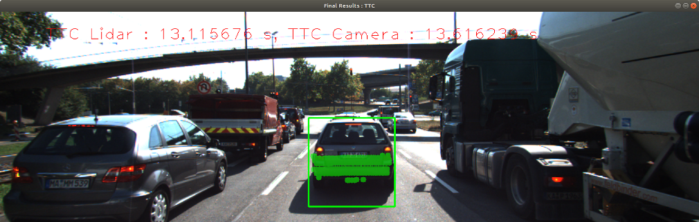
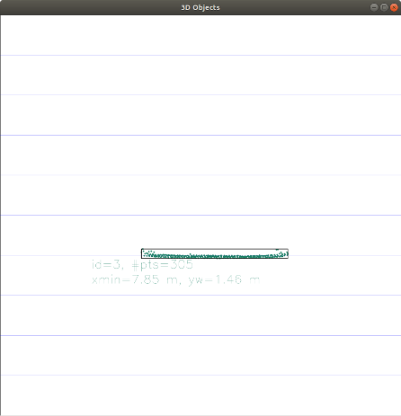

# SFND 3D Object Tracking

Welcome to the final project of the camera course. By completing all the lessons, you now have a solid understanding of keypoint detectors, descriptors, and methods to match them between successive images. Also, you know how to detect objects in an image using the YOLO deep-learning framework. And finally, you know how to associate regions in a camera image with Lidar points in 3D space. Let's take a look at our program schematic to see what we already have accomplished and what's still missing.


In this final project, you will implement the missing parts in the schematic. To do this, you will complete four major tasks:
1. First, you will develop a way to match 3D objects over time by using keypoint correspondences.
2. Second, you will compute the TTC based on Lidar measurements.
3. You will then proceed to do the same using the camera, which requires to first associate keypoint matches to regions of interest and then to compute the TTC based on those matches.
4. And lastly, you will conduct various tests with the framework. Your goal is to identify the most suitable detector/descriptor combination for TTC estimation and also to search for problems that can lead to faulty measurements by the camera or Lidar sensor. In the last course of this Nanodegree, you will learn about the Kalman filter, which is a great way to combine the two independent TTC measurements into an improved version which is much more reliable than a single sensor alone can be. But before we think about such things, let us focus on your final project in the camera course.

## Dependencies for Running Locally
* cmake >= 2.8
  * All OSes: [click here for installation instructions](https://cmake.org/install/)
* make >= 4.1 (Linux, Mac), 3.81 (Windows)
  * Linux: make is installed by default on most Linux distros
  * Mac: [install Xcode command line tools to get make](https://developer.apple.com/xcode/features/)
  * Windows: [Click here for installation instructions](http://gnuwin32.sourceforge.net/packages/make.htm)
* Git LFS
  * Weight files are handled using [LFS](https://git-lfs.github.com/)
  * Install Git LFS before cloning this Repo.
* OpenCV >= 4.1
  * This must be compiled from source using the `-D OPENCV_ENABLE_NONFREE=ON` cmake flag for testing the SIFT and SURF detectors.
  * The OpenCV 4.1.0 source code can be found [here](https://github.com/opencv/opencv/tree/4.1.0)
* gcc/g++ >= 5.4
  * Linux: gcc / g++ is installed by default on most Linux distros
  * Mac: same deal as make - [install Xcode command line tools](https://developer.apple.com/xcode/features/)
  * Windows: recommend using [MinGW](http://www.mingw.org/)

## Basic Build Instructions

1. Clone this repo
2. Download yolo required files to `dat/yolo`
    - Filenames with download links can be found in [dat/yolo/required_files.cfg](./dat/yolo/required_files.cfg)
3. Download image dataset to `images/KITTI/2011_09_26/`
    -  Download link can be found in [images/KITTI/2011_09_26/required_files.cfg](./images/KITTI/2011_09_26/required_files.cfg)
4. Make a build directory in the top level project directory: `mkdir build && cd build`
5. Compile: `cmake .. && make`
6. Run it: `./3D_object_tracking`
    - It prints all input argument options - select based on requirements

## Results

Solutions (MP.#) from [Camera Based 2D Feature Tracking](https://github.com/lukaumi/Sensor-Fusion-Engineer-Nanodegree/tree/main/projects/2-Camera_Based_2D_Feature_Tracking) mid-term project are reused.

Tasks (FP.#) described in [Project Specification](./project_rubric.pdf) are implemented and denoted in [source code](./src/). Each task solution can be found enclosed with comments, e.g.:
```
//// STUDENT ASSIGNMENT
//// TASK FP.#

  ... task code implementation

//// EOF STUDENT ASSIGNMENT
```

### FP.1

Function `matchBoundingBoxes` takes as input both the previous and the current data frames, as well as keypoint descriptors matches and provides as output the ids of the matched regions of interest (i.e. the boxID property). Each of the bounding boxes in previous and current frames is iterated to check for all the matched pairs found by descriptor matching. The bounding boxes pairs with the highest number of keypoints matched pairs are considered the best matches.

### FP.2

Function `computeTTCLidar` computes the time-to-collision (TTC) in seconds for all matched 3D objects using only lidar measurements from the matched bounding boxes between current and previous frame. It takes lidar points from previous and current frame, as well as frame rate as an input and returns numeric TTC value.

Before TTC calculation, lidar points from previous and current frame are filtered. Those that are outside the ego lane and those that are not within 3 standard deviations of the mean ([info1](https://www.scribbr.com/statistics/standard-deviation/), [info2](https://www.sixsigmadaily.com/standard-deviation-6-steps-to-calculation/)) are removed.

TTC is calculated using constant velocity model.

### FP.3

Function `clusterKptMatchesWithROI` associates keypoint correspondences to the bounding boxes which enclose them. It takes bounding box ROI, keypoints from previous and current frame and their matches as input, and returns keypoint ROI keypoint matches.

Keypoints that are not in bounding box ROI and that are smaller than the mean of all euclidean distances between keypoint matches are removed.

### FP.4

Function `computeTTCCamera` computes the time-to-collision (TTC) in seconds for all matched 3D objects using only keypoint correspondences from the matched bounding boxes between current and previous frame. It takes keypoints from previous and current frame, their matches as well as frame rate as an input and returns numeric TTC value.

TTC is calculated by using constant-velocity-model from distance ratio scale change of the preceding vehicle between the previous and current frame. Keypoints outliers are removed by using median of distance ratios.

### Performance Evaluation

The following image shows an example of a lidar and camera TTC estimation for one frame.



### FP.5

The following table shows lidar TTC estimations for 18 images (frames). Used lidar points are bounded within object bounding boxes created by the YOLO object detection algorithm, and are independent of any feature detectors and descriptors used.

|            | #1 | #2 | #3 | #4 | #5 | #6 | #7 | #8 | #9 | #10 | #11 | #12 | #13 | #14 | #15 | #16 | #17 | #18 |
|:----------:|:---:|:---:|:---:|:---:|:---:|:---:|:---:|:---:|:---:|:---:|:---:|:---:|:---:|:---:|:---:|:---:|:---:|:---:|
| Lidar TTC  | 12.187797 | 13.115676 | 16.788090 | 14.598984 | 12.797997 | 13.294750 | 13.745902 | 13.741533 | 11.754923 | 12.139050 | 11.913053 | 10.281722 | 9.177242 | 9.483886 | 8.428278 | 9.007221 | 10.862383 | 8.450958 |

There aren't any values that stand out, i.e. there aren't estimations where TTC does not seem plausible. This shows that outlier removal was efficient.
However, these results were obtained by using constant velocity model and frame rate for time interval, both of which are not applicable in a real-world scenario.

The following image shows an example of a bird's-eye view plot of preceding vehicle's lidar point cloud.



### FP.6

Parameters used:
  ```
  ./3D_object_tracking --detector_type <detector> --descriptor_type <descriptor> --descriptor_content_type DES_BINARY --matcher_type MAT_BF --selector_type SEL_KNN

  // NOTE: for --descriptor_type SIFT, use --descriptor_content_type DES_HOG
  ```

The following tables shows camera TTC estimations for 18 images using all possible combinations of detectors and descriptors.

NOTE: Data is not available for some combinations due to detector and descriptor [incompatibilities](https://knowledge.udacity.com/questions/105392).

| Detector/Descriptor | #1 | #2 | #3 | #4 | #5 | #6 | #7 | #8 | #9 | #10 | #11 | #12 | #13 | #14 | #15 | #16 | #17 | #18 |
|:----------:|:---:|:---:|:---:|:---:|:---:|:---:|:---:|:---:|:---:|:---:|:---:|:---:|:---:|:---:|:---:|:---:|:---:|:---:|
| Shi-Tomasi/BRISK | 39.148297 | *-inf* | 13.490395 | 12.397977 | 12.675404 | *-inf* | *-inf* | *-inf* | 11.512622 | *-inf* | 11.302411 | 11.652406 | 11.724344 | 12.834771 | 9.337846 | 11.307930 | 11.448724 | 9.127923 |
| Shi-Tomasi/BRIEF | 13.894765 | 13.148670 | 14.917303 | 13.079095 | 12.137559 | *-inf* | 18.336755 | 13.278743 | 12.462969 | 13.344794 | 12.258695 | 12.769816 | 12.704197 | 14.684487 | 22.118436 | 11.385566 | 13.606274 | 7.750389 |
| Shi-Tomasi/ORB | 13.880059 | *-inf* | 11.892371 | 12.131894 | 13.442338 | *-inf* | 15.006519 | 12.202219 | 11.265304 | 13.496167 | 11.324619 | *-inf* | 12.802997 | 11.559380 | 10.259178 | 12.203265 | 13.526059 | 11.862922 |
| Shi-Tomasi/FREAK | 13.724887 | 13.092722 | 11.470275 | 11.254089 | 12.370474 | 14.238518 | 12.564543 | 12.851473 | 12.041425 | 13.008396 | *-inf* | 11.822715 | 12.343584 | *-inf* | 10.296963 | 11.315296 | 12.963025 | 12.259991 |
| Shi-Tomasi/SIFT | 1008.716664 | 19.218595 | *-inf* | 13.019157 | 13.411312 | *-inf* | 15.800255 | *-inf* | *-inf* | 13.359891 | 12.461615 | 11.652406 | 13.100892 | 14.684487 | 15.341934 | 16.179434 | 48.514355 | 13.963394 |
| Harris/BRISK | *-inf* | 10.585996 | *nan* | 10.978246 | *-inf* | *nan* | 12.239489 | 17.620382 | *nan* | *-inf* | *-inf* | *-inf* | *-inf* | *nan* | -13.626283 | 6.657258 | *nan* | *-inf* |
| Harris/BRIEF | *-inf* | *nan* | *-inf* | 10.978246 | 35.383263 | *nan* | 13.496977 | *-inf* | *nan* | 20.586216 | *-inf* | *-inf* | 13.432725 | 5.606097 | *-inf* | 7.037751 | 12.584845 | *-inf* |
| Harris/ORB | *-inf* | *nan* | *-inf* | 10.978246 | 35.383263 | *nan* | 13.190481 | *-inf* | *nan* | *-inf* | 11.741430 | *-inf* | *-inf* | 5.660966 | *-inf* | 10.932493 | *nan* | *-inf* |
| Harris/FREAK | *-inf* | *nan* | *nan* | 12.128391 | 35.383263 | *nan* | 12.337898 | 12.916210 | *nan* | *-inf* | *-inf* | *-inf* | *-inf* | *nan* | *-inf* | 6.717055 | *nan* | *nan* |
| Harris/SIFT | *-inf* | *nan* | -11.473146 | 10.978246 | 35.383263 | 13.590710 | *-inf* | *-inf* | *nan* | 10.293108 | 11.741430 | *-inf* | *-inf* | 5.606097 | -13.626283 | 10.932493 | *nan* | *-inf* |
| FAST/BRISK | 12.300000 | 12.345282 | *-inf* | 12.885663 | *-inf* | 13.038573 | 12.040983 | 11.728461 | 11.868356 | 13.347326 | 12.949216 | 12.117402 | 12.914231 | 11.607725 | 11.407860 | 12.256560 | 9.293304 | 11.860611 |
| FAST/BRIEF | 11.177575 | 18.272682 | 21.091622 | 13.248256 | *-inf* | *-inf* | 12.464179 | 12.766404 | *-inf* | 16.214137 | 13.635546 | *-inf* | 13.148670 | 11.855532 | 13.635898 | 14.551571 | 11.341063 | 109.968649 |
| FAST/ORB | 81.267112 | 27.333461 | 26.572394 | 13.781602 | *-inf* | *-inf* | 12.934828 | 12.562352 | 12.871126 | *-inf* | *-inf* | *-inf* | *-inf* | 11.296107 | 10.767322 | 12.101945 | 11.951042 | 109.968649 |
| FAST/FREAK | 51.577224 | 16.138734 | 13.572698 | 14.031572 | 99.562795 | 12.329150 | *-inf* | 11.546717 | *-inf* | 13.416893 | 13.019157 | 12.036413 | 11.659949 | 11.348694 | 11.029640 | 12.101945 | 12.102398 | 11.860611 |
| FAST/SIFT | *-inf* | 16.984377 | 18.774277 | 15.489686 | *-inf* | *-inf* | 12.728236 | 12.918865 | *-inf* | 17.146740 | 13.793456 | 13.071736 | 13.507065 | 13.190203 | 13.635898 | 14.140712 | 12.108618 | 60.245361 |
| BRISK/BRISK | 13.031013 | 23.102704 | 22.693533 | 15.620977 | 24.973308 | 15.931886 | 17.860712 | 27.307238 | 15.746865 | 13.412117 | 12.136334 | 11.010747 | 11.861760 | 12.037588 | 18.322046 | 11.296855 | 10.887636 | 13.713553 |
| BRISK/BRIEF | 19.898700 | 32.186745 | 27.293402 | 23.618613 | 29.441598 | 63.346161 | 28.167161 | 18.406368 | 23.841102 | 20.978404 | 24.062890 | 19.544662 | 20.594385 | 21.949429 | 11.030901 | 19.310444 | 18.282581 | 22.420952 |
| BRISK/ORB | 39.413641 | 18.409591 | 20.970924 | 17.914696 | 18.972406 | 19.425573 | 17.900421 | 18.365323 | 14.340733 | 13.667004 | 13.266080 | 18.753533 | 11.659895 | 12.293939 | 12.175351 | 11.447521 | 19.536405 | 21.862065 |
| BRISK/FREAK | 12.360057 | 28.318336 | 14.191460 | 13.829347 | 33.122177 | 17.893574 | 15.890559 | 28.007854 | 24.099313 | 15.086943 | 17.373846 | 14.312205 | 19.351723 | 12.188175 | 23.130393 | 10.379768 | 9.334353 | 11.617621 |
| BRISK/SIFT | 14.679965 | 17.452406 | 18.227382 | 14.254126 | 22.841660 | 17.388163 | 15.976474 | 17.470369 | 15.917949 | 16.438666 | 12.139418 | 13.482608 | 13.258854 | 13.250049 | 14.458860 | 11.090855 | 11.525373 | 12.642182 |
| ORB/BRISK | *-inf* | *-inf* | *-inf* | *-inf* | *-inf* | 10.841149 | *-inf* | *-inf* | *-inf* | *-inf* | 10.455956 | *-inf* | 7.978165 | *-inf* | *-inf* | *-inf* | *-inf* | 60.108844 |
| ORB/BRIEF | *-inf* | *-inf* | *-inf* | 24.402313 | 41.707990 | -48.151955 | *-inf* | 34.629764 | *-inf* | 359.022133 | 21.391750 | *-inf* | *-inf* | 25.883387 | *-inf* | 14.679284 | 3207.997485 | *-inf* |
| ORB/ORB | *-inf* | 10.751135 | *-inf* | *-inf* | *-inf* | 18.454940 | *-inf* | *-inf* | *-inf* | *-inf* | 8.942120 | *-inf* | *-inf* | *-inf* | *-inf* | *-inf* | 16.666733 | *-inf* |
| ORB/FREAK | *-inf* | *-inf* | 12.122075 | 1608.040600 | *-inf* | *-inf* | *-inf* | 697.147262 | *-inf* | *-inf* | 8.407813 | *-inf* | 9.752856 | *-inf* | *-inf* | 13.175592 | -2004.305094 | 12.831716 |
| ORB/SIFT | 16.726022 | 19.241500 | 12.267585 | 330.969511 | 192.407057 | 17.063737 | *-inf* | 13.022866 | *-inf* | *-inf* | 8.291247 | *-inf* | *-inf* | 13.764305 | *-inf* | 15.898307 | 27.454605 | 22.032006 |
| SIFT/BRISK | 11.591711 | 13.053436 | 13.543964 | 44.427215 | 15.072484 | 25.726896 | 14.052206 | 14.949436 | 13.403750 | 18.520413 | 12.758785 | 10.251828 | 9.578441 | 15.089278 | 14.817667 | 13.685437 | 9.529604 | 13.861791 |
| SIFT/BRIEF | 12.160517 | 13.080840 | 15.088081 | 25.282500 | 13.219568 | 11.966614 | 19.908627 | 19.828959 | 12.745671 | 12.270228 | 14.157550 | 10.495827 | 13.163457 | 14.433670 | 10.087374 | 13.591303 | 11.649561 | 15.223147 |
| SIFT/FREAK | 11.263230 | 13.616239 | 13.542345 | 20.514344 | 17.135368 | 11.975084 | 14.618022 | 13.187221 | 18.160292 | 11.366112 | 16.687601 | 18.038248 | 10.045956 | 9.838796 | 8.987922 | 8.724788 | 9.597269 | 9.405695 |
| SIFT/SIFT | 11.387208 | 12.572196 | 12.942524 | 18.818332 | 12.478066 | 11.592426 | 13.573451 | 14.694781 | 12.966247 | 17.680267 | 11.288740 | 11.019113 | 14.716260 | 10.576043 | 9.774648 | 9.052260 | 8.691902 | 13.487159 |
| AKAZE/AKAZE | 16.840898 | 24.287135 | 16.359111 | 14.245365 | 16.462302 | 22.415005 | 18.232181 | 21.913559 | 20.760573 | 17.332748 | 18.283075 | 16.156439 | 11.010692 | 16.920727 | 15.494502 | 14.147067 | 14.207825 | 13.473436 |

There are a lot of unreliable and extreme estimations and there are multiple frames where TTC could not be estimated (nan or -inf). This could come frome feature eculidean distance being very similar for two frames and the outliers that weren't removed successfully. In general, mean-filtering is not robust enough.

Based on the values above, camera TTC estimations seem to be inferior to lidar estimation for this implementation and dataset.
