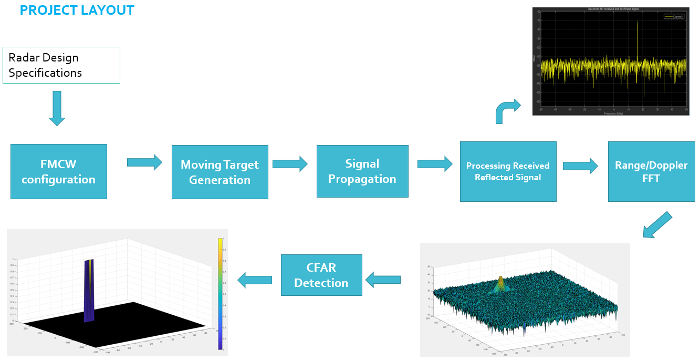
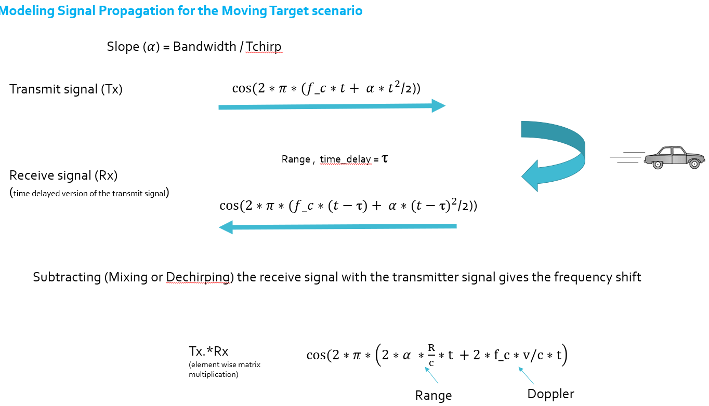
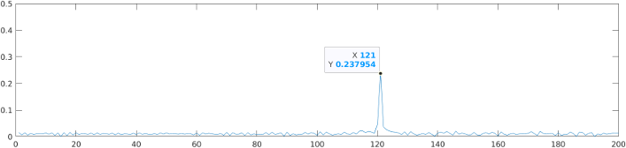
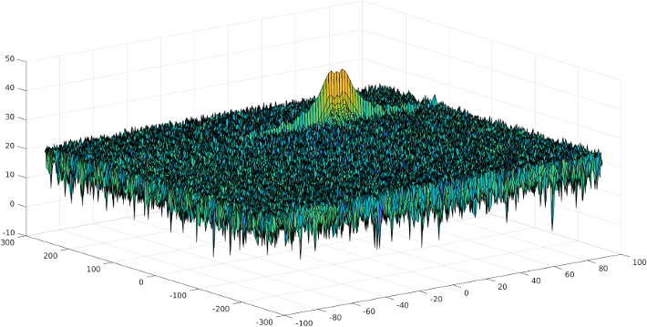
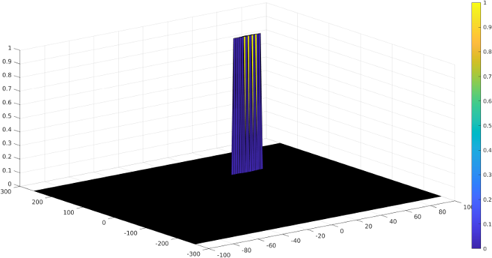

# Project Overview

- configure the FMCW waveform based on the system requirements
- define the range and velocity of target and simulate its displacement
- for the same simulation loop process the transmit and receive signal to determine the beat signal
- perform range FFT on the received signal to determine the range
- perform the CFAR processing on the output of 2nd FFT to display the target

## Radar System Requirements

- system requirements define the design of a radar
- the sensor fusion design for different driving scenarios requires different system configurations from a radar
- in this project, a radar is designed based on the given system requirements:
    - frequency: 77GHz
    - range resolution: 1m
    - max range: 200m
    - max velocity: 70 m/s
    - velocity resolution: 3 m/s

##

- max range and range resolution are considered for waveform design
- the sweep bandwidth can be determined according to the range resolution and the sweep slope is calculated using both sweep bandwidth and sweep time:
$$Bandwidth (B_{sweep}) = \dfrac{speed \ \ of \ \ light}{2*rangeResolution}$$
- the sweep time can be computed based on the time needed for the signal to travel the unambiguous maximum range
  - in general, for an FMCW radar system, the sweep time should be at least 5 to 6 times the round trip time
  - this example uses a factor of 5.5:
  $$T_{chirp} =5.5\cdot 2 \cdot \dfrac{R_{max}}{c}$$
  - giving the slope of the chirp signal:
  $$Slope = \dfrac{Bandwidth}{T_{chirp}}$$
- the initial elective range and velocity of the target are provided
  - range cannot exceed the max value of 200m and velocity can be any value in the range of -70 to +70 m/s

## Target Generation and Detection

- in terms of wave equation, FMCW transmit and received signals are defined using these wave equations, where
$$\alpha = Slope \ \ of \ \ the \ \ signal$$
- the transmit signal is given by:
$$T_x= \cos \left(2\pi \left(f_ct + \dfrac{\alpha t^2}{2}\right)\right)$$
- the received signal is nothing but the time delayed version of the transmit signal
  - in digital signal processing the time delayed version is defined by $(t -\tau)$, where $\tau$ represents the delay time, which in radar processing is the trip time for the signal
  - replacing $t$ with $(t -\tau)$ gives the receive signal:
  $$R_x = \cos \left (2\pi \left (f_c (t-\tau) + \dfrac{\alpha(t-\tau)^2}{2}\right)\right)$$
- on mixing these two signals, we get the beat signal, which holds the values for both range as well as doppler
  - by implementing the 2D FFT on this beat signal, we can extract both range and doppler information
- the beat signal can be calculated by multiplying the transmit signal with receive signal
  - this process in turn works as frequency subtraction
    - it is implemented by element by element multiplication of transmit and receive signal matrices
        - [mixed or beat signal](https://www.mathworks.com/help/fixedpoint/ref/times.html) = $(Tx.*Rx)$
        - the above operation gives:
        $$Tx.*Rx = \cos \left (2\pi \left (\dfrac{2\alpha R}{c}t + \dfrac{2f_cvn}{c}t \right) \right)$$

## FFT Operation

### 1D FFT
- implement the 1D FFT on the mixed signal
- reshape the vector into $N_r \cdot N_d$ array
- run the FFT on the beat signal along the range bins dimension ($N_r$)
- normalize the FFT output
- take the absolute value of that output
- keep one half of the signal
- it generates a peak at the initial position of the target

### 2D FFT
- take a 2D signal matrix
- in the case of radar signal processing, convert the signal in MxN matrix, where M is the size of range FFT samples and N is the size of doppler FFT samples
- run the 2D FFT across both the dimensions
- shift zero-frequency terms to the center of the array
- take the absolute value
- it generates a range doppler map

## 2D CFAR

- determine the number of training cells for each dimension and similarly, pick the number of guard cells
- slide the cell under test across the complete matrix
  - make sure the CUT has margin for training and guard cells from the edges
- for every iteration sum the signal level within all the training cells
  - to sum convert the value from logarithmic to linear using `db2pow` function
- average the summed values for all of the training cells used and after averaging convert it back to logarithmic using `pow2db`
- add the offset to it to determine the threshold
- compare the signal under CUT against this threshold
- if the CUT level > threshold assign it a value of 1, else equate it to 0
- the generates a thresholded block, which is smaller than the range doppler map as the CUTs cannot be located at the edges of the matrix due to the presence of target and guard cells
  - hence, those cells are not thresholded
- to keep the map size same as it was before CFAR, equate all the non-thresholded cells to 0

# Project Implementation

- [project_rubric.pdf](./project_rubric.pdf)
- code implementation of the methods and solutions described above is in [radar_target_generation_and_detection.m](./radar_target_generation_and_detection.m)
